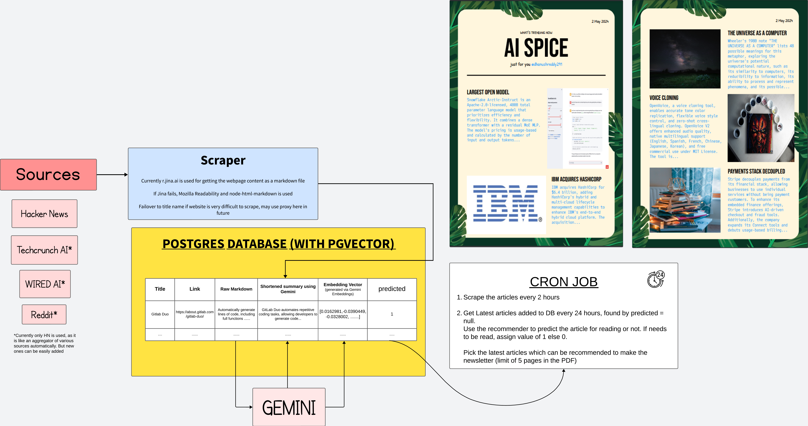

# Flowchart of the Article Recommnder System

 - We select a set of source websites such as Hackernews, Techcrunch, Wired, Reddit, etc.
 - Run a cron job every 2 hours to scrape the latest articles from these websites.
 - The articles are converted to markdown using [Jina Reader](https://jina.ai/reader/) which converts HTML pages to Markdown.
 - The raw markdown text is stored in DB.
 - [Gemini API](https://ai.google.dev) is used for converting this raw markdown into short summary of 4-5 lines and then again convert the summary into embeddings.
 - A recommendation algorithm of random forest is used to recommend articles based on the embeddings.
 - For this to work, we already need to get the user's taste in articles. This can be done by asking the user to rate a few articles. We can then use this data to train the random forest model.
- The model is then used to recommend articles to the user.
- 2nd Cron job is used to pick the latest articles from db which the user may like and convert them into a newsletter format as a PDF.
- Currently the code is bit scrambled and needs to be cleaned up. I am converting everything into a Docker Image which also has a support for Flipbook PDF which also generates a voiceover video while turning the pages, and auto posting to Youtube based on CRON.
- I will be raising PR for the cleaned up code soon as it is easy to understand and use.

- A sample PDF is attached in the repo which is generated by the code. The code is still in development and will be updated soon.

- Currently the random classifier code and scraper part is on [Deepnote](https://deepnote.com). I will be moving it to the repo soon.

- The current code just contains the PDF generation part, it selects articles from DB and converts them into a PDF.