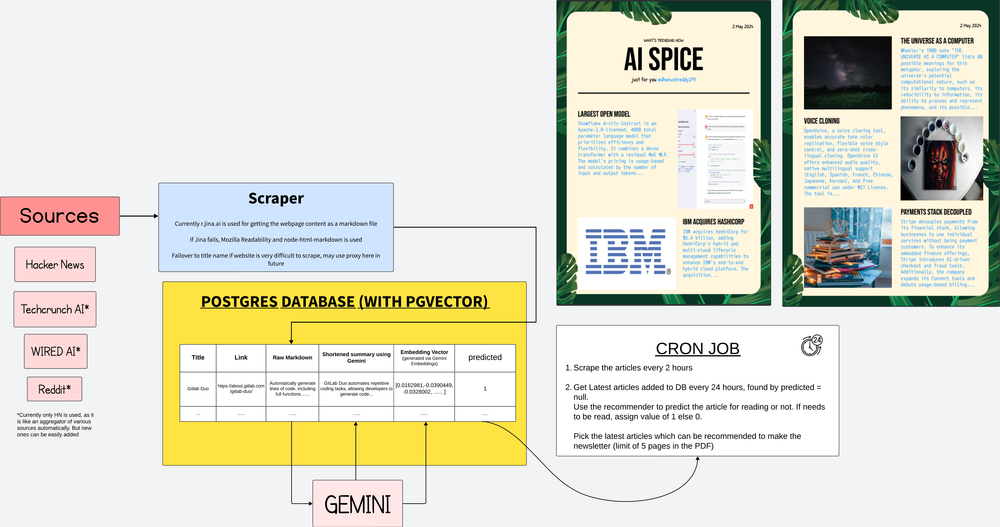

# Flowchart of the Article Recommnder System

- We select a set of source websites such as Hackernews, Techcrunch, Wired, Reddit, etc.
- Run a cron job every 2 hours to scrape the latest articles from these websites.
- The articles are converted to markdown using [Jina Reader](https://jina.ai/reader/) which converts HTML pages to Markdown.
- The raw markdown text is stored in DB.
- [Gemini API](https://ai.google.dev) is used for converting this raw markdown into short summary of 4-5 lines and then again convert the summary into embeddings.
- A recommendation algorithm of random forest is used to recommend articles based on the embeddings.
- For this to work, we already need to get the user's taste in articles. This can be done by asking the user to rate a few articles. We can then use this data to train the random forest model.
- The model is then used to recommend articles to the user.
- 2nd Cron job is used to pick the latest articles from db which the user may like and convert them into a newsletter format as a PDF.

- 1st cron job file is `cron_2hour_to_add_new_articles.js` and 2nd cron job file is `cron_2hour_to_generate_newsletter.js`

- Two sample PDF's are attached in the repo which is generated by the code.
